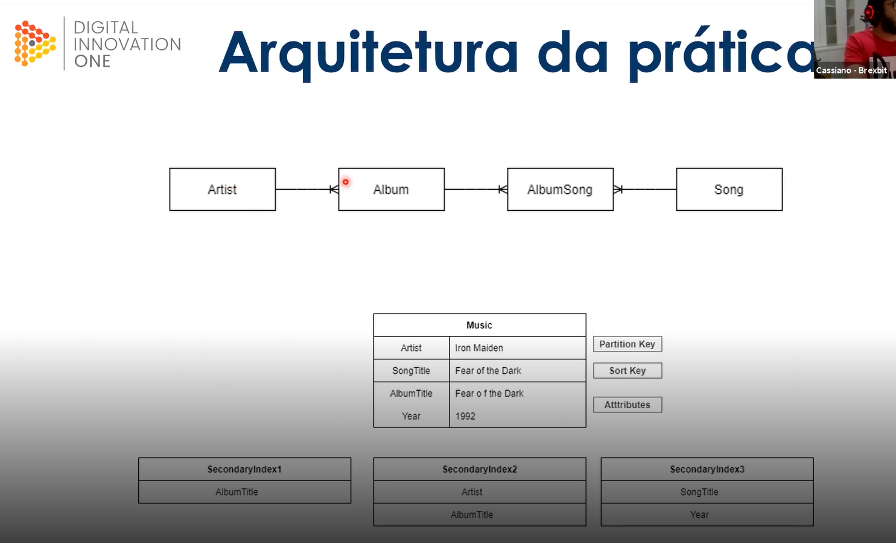

# dio-desafio-projeto-dynamodb
Repositório do desafio de projeto "Boas práticas com DynamoDB" do Bootcamp Banco "PAN Java Developer"

## Arquitetura de exemplo

**nota**: entidades e atributos traduzidos para pt_br

### Serviços/ferramentas utilizadas
- AWS DynamoDB
- AWS CLI (client) para execução em linha de comando
  - Configurando:
    - Baixar em https://aws.amazon.com/pt/cli/ e instalar
    - ``$ aws config`` passando as credenciais da AWS
    
### Desenvolvimento do desafio

- Criar tabela/coleção 'musica'
``` 
aws dynamodb create-table \
    --table-name musica \
    --attribute-definitions \
        AttributeName=Artista,AttributeType=S \
        AttributeName=TituloMusica,AttributeType=S \
    --key-schema \
        AttributeName=Artista,KeyType=HASH \
        AttributeName=TituloMusica,KeyType=RANGE \
    --provisioned-throughput \
        ReadCapacityUnits=10,WriteCapacityUnits=5
```

